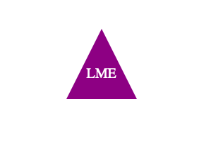

# SVG_Logo_Maker

## Description

This project was created to build a Node.js command-line application that takes in user input to generate a logo and save it as an SVG file.

"Scalable Vector Graphics (SVG) is an XML-based vector image format for defining two-dimensional graphics, having support for interactivity and animation".

## Table of Contents
- [Description](#description)
- [Table of Contents](#table-of-contents)
- [Installation](#installation)
- [Usage](#usage)
- [License](#license)
- [Note](#note)

## Installation

N/A

## Usage

The link to the walkthrough video is 

The command-line application dynamically generates a logo from a user's input.

## License

## Note

This project was created based on reviewing activities from the previous classes at bootcamp and Google searches.

